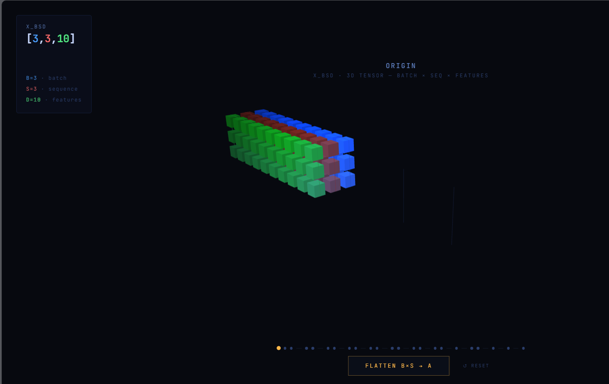

# MoE Forward Pass — Interactive 3D Visualiser

An interactive, step-by-step 3D visualisation of the **Mixture-of-Experts forward pass** used in [Llama 4](https://ai.meta.com/blog/llama-4-multimodal-intelligence/). Every tensor operation is animated in real time — shapes, addresses, and data flow — so you can *see* exactly what the code is doing.

**[→ Live demo](llama4-moe-viz.netlify.app/)** 



---

## What it visualises

The full `forward()` method of the MoE layer, one click at a time:

| Step | Operation | Shape change |
|------|-----------|--------------|
| 0 | **Flatten** `x_bsD.view(-1, D)` | `[3,3,10]` → `[9,10]` |
| 1 | **Router scores** `x_aD @ W_router` | `[9,10]` → `[3,9]` |
| 2 | **Top-K** `torch.topk(router_scores.T, K=1)` | picks winner per token |
| 3 | **Scatter** scores back → `router_scores [3,9]` | zeros out losers |
| 4 | **Sigmoid** squash winner scores to `(0,1)` | in-place |
| 5 | **Arange** `torch.arange(A).expand(E,-1)` | `router_indices [3,9]` |
| 6 | **Reshape** `router_indices` → `[27,1]` | row-major stack |
| 7 | **Expand** → `[27,10]` | broadcast across D |
| 8 | **Gather** `torch.gather(x_aD, dim=0, index=…)` | `routed_in_EG_D [27,10]` |
| 9 | **Scale** `× router_scores.reshape(-1,1)` | weight by sigmoid score |
| 10 | **Reshape scores** `router_scores [3,9]` → `[27,1]` | for scatter_add |
| 11 | **Build** `router_indices_EG_D [27,10]` | reshape + expand |
| 12 | **Scatter add** `out_aD.scatter_add_(…)` | expert outputs → tokens |
| 13 | **View** `out_aD.view(-1, slen, D)` | `[9,10]` → `[3,3,10]` |

---

## How to use

### Option A — open locally

```bash
git clone https://github.com/your-username/moe-viz.git
cd moe-viz
open index.html          # macOS
xdg-open index.html      # Linux
start index.html         # Windows
```

No build step. No dependencies to install. Single HTML file.

### Option B — GitHub Pages

1. Push to GitHub
2. Go to **Settings → Pages → Source → main / (root)**
3. Your visualiser is live at `https://your-username.github.io/moe-viz/`

---

## Controls

| Input | Action |
|-------|--------|
| **Click button** | Advance to next step |
| **← back** | Step back through history |
| **↺ reset** | Return to initial state |
| **Drag** | Orbit camera |
| **Scroll** | Zoom |
| **Hover** over a voxel | Inspect tensor value |

---

## The code being visualised

```python
def forward(self, x_bsD: Tensor) -> Tensor:
    _, slen, D = x_bsD.shape

    # Flatten [B, S, D] → [B×S, D]
    x_aD = x_bsD.view(-1, D)
    a = x_aD.shape[0]

    # Router: [a,D] @ [D,E] → [E,a]
    router_scores: Tensor = torch.matmul(x_aD, self.router_DE).transpose(0, 1)

    # Top-K per token
    router_scores_aK, router_indices_aK = torch.topk(
        router_scores.transpose(0, 1), self.moe_args.top_k, dim=1
    )

    # Scatter winners back, zero losers
    router_scores = (
        torch.full_like(router_scores.transpose(0, 1), float("-inf"))
        .scatter_(1, router_indices_aK, router_scores_aK)
        .transpose(0, 1)
    )

    # Token-index grid [E, a]
    router_indices = (
        torch.arange(a, device=x_aD.device).view(1, -1).expand(router_scores.size(0), -1)
    )

    # Sigmoid: -inf → 0, winners → (0,1)
    router_scores = torch.sigmoid(router_scores)

    # Gather expert inputs: [E×a, D]
    routed_in_EG_D: Tensor = torch.gather(
        x_aD, dim=0,
        index=router_indices.reshape(-1, 1).expand(-1, D)
    )

    # Weight by router scores
    routed_in_EG_D = routed_in_EG_D * router_scores.reshape(-1, 1)

    # Shared expert + routed experts
    out_aD = self.shared_expert(x_aD)
    routed_out_eg_D = self.experts(routed_in_EG_D.detach())

    # Address matrix for scatter_add
    router_indices_EG_D = router_indices.reshape(-1, 1).expand(-1, D)

    # Accumulate expert outputs back into token positions
    out_aD.scatter_add_(dim=0, index=router_indices_EG_D, src=routed_out_eg_D)

    # Reshape back to [B, S, D]
    return out_aD.view(-1, slen, D)
```

---

## Design

Built with:
- **[Three.js r128](https://threejs.org/)** — 3D voxel rendering
- **[GSAP 3](https://greensock.com/gsap/)** — all animations and tweens
- **[JetBrains Mono](https://www.jetbrains.com/lp/mono/)** — monospace UI font
- Zero build tooling. Zero npm. One file.

The visualiser uses `B=3, S=3, D=10, E=3, K=1` as concrete dimensions so every tensor is small enough to show every individual cell. Colours encode semantics: token identity (blue→red gradient), expert ownership (purple/cyan/orange), and scalar magnitude (brightness).

---

## File structure

```
llama4-moe-viz/
├── index.html         
├── css/
│   └── style.css        
├── js/
│   └── main.js       
├── README.md
├── LICENSE
└── .gitignore
```

---

## Licence

MIT
